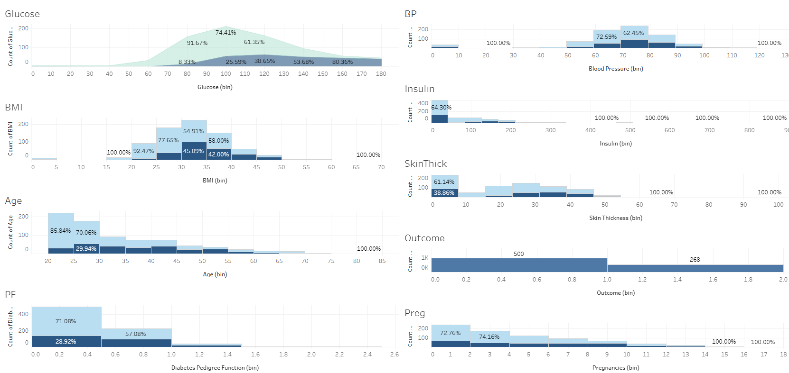

# diabetes-data-analysis-tableau
This is the Diabetes data Analysis and Viz Project done on tableau

# Diabetes Data Analysis (Tableau)

This repository contains a Tableau dashboard analyzing factors that contribute to diabetes using the Pima Indians dataset.

## Files
- `Diabetes_Data_Analysis.twbx`: Tableau Packaged Workbook
- `diabetes.csv`: Dataset used for analysis

## Insights
🧠 Insights:
-Glucose is by far the most important feature.
-Age, family history (DiabetesPedigreeFunction), and BMI are also strong indicators.
-BloodPressure and SkinThickness show little or even negative correlation with the outcome.

## View Online
🔗 [Dashboard on Tableau Public](https://public.tableau.com/app/profile/kanika.dhyani/viz/Diabetes_Data_Analysis_17478845340210/Diabetes_Data_Analysis)

## Visualizations

### 🔍 Feature Correlation of Age, BMI, Pregnancy with Diabetes Outcome

